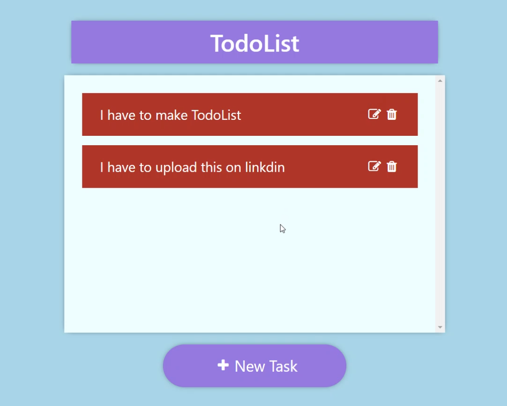

# Todo-List Using Html, CSS, Bootstrap and JavaScript

<h1>📝Todo-List Description</h1>

This vibrant to-do list project is a dynamic web application designed to help users stay organized and productive. Crafted with HTML, CSS, and JavaScript, the application provides an intuitive interface for managing tasks with ease. 🚀 Add, delete, and update tasks effortlessly, prioritize your to-dos, and track your progress as you work towards your goals. Whether it's for personal projects, work assignments, or daily chores, this to-do list offers a streamlined solution for organizing your tasks and boosting your productivity. 💡 Stay focused, stay organized, and accomplish more with this user-friendly to-do list application.

 
